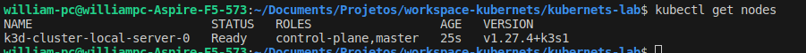
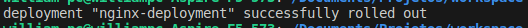

## Conceitos

Necessidade
 - Variáveis de ambiente
 - Gerenciamento de senhas/secrets
 - Escolher os recursos computacionais que a minha aplicação roda
 - Healh Check
 - Load Balancing
 - SSL/TLS
 - Domínio (www) - Determinado serviço - Ingress
 - Estratégia de deploy (Blue/Green, Canary, etc)
 - Storage
 - Service Discovery / DNS
---

## 1. Instale Localmente
Primeiramente requisito antes de seguir instalando as ferramentas é ter o docker instalado. Depois de instalado siga os próximos passos.

### Instale o K3D localmente

Instale o k3d para poder criar clusters locamente com kubernets

```shell
curl -s https://raw.githubusercontent.com/k3d-io/k3d/main/install.sh | TAG=v5.0.0 bash
```
E logo após, crie um cluster com comando
```shell
k3d cluster create cluster-local
```
### Instale o kubectl
Veja como instalar o Kubectl dependendo de qual sistema operacional estaja utilizando em: https://kubernetes.io/docs/tasks/tools/

### Testando Cluster
Para ver se está instalado as ferramentas e se o cluster criado  execute:
```shell
kubectl get nodes
```
Ao rodar esse comando deve aparecer algo como no exemplo:




> **Obs:**
> 
> Veja mais sobre o K3D em: https://k3d.io/v5.6.0/
---
## 2. Workloads
Os arquivos de manifestos dos exemplos para subir com  `kubectl` estão na pasta `\manifestos`.

### 2.1. Pods

a. Subindo um pod pelo manifesto `pod.yaml`
```shell
kubectl apply -f pod.yaml
```
b. View Pods
```shell
kubectl get pods
```


c. Deletar um pod
```shell
kubectl delete pod nginx
```

O problema de subir apenas pods é que não tem outro pod rodando significando que a aplicação ficará fora do ar. Ou seja, não tem gerenciamento nenhum de replicas.

> **Referencias:**
>
> Mais sobre maniresto de pods veja em: https://kubernetes.io/docs/concepts/workloads/pods/


### 2.2. ReplicaSet


`ReplicaSet` ou `RS` é uma camada acima de pods que tem a função de verificação de pods garandindo que estejam sempre 
rodando. Através do `RS` que se configura o número de pods que devem estar rodando de uma aplicação e quantas réplicas 
do mesmo devem estar rodando. E para que o ReplicaSet possa saber os pods que serão replicados é necessário criar`label`
nos pods e vincular o `RS` ao Pod pela chave `matchLabels.app:`, pois é através disso que o `RS` gerencia os pods. 


#### Subindo um ReplicaSet pelo manifesto

```shell
kubectl apply -f replicaset.yaml
```
#### Visualizar os ReplicaSet

```shell
kubectl get rs
```


 Se visualizar os pods com `kubectl get pods` obterá um nome algo parecido com `nginx-replicaset-<hash>` mostrando que o
 pod está sendo gerenciado pelo replicaset `nginx-replicaset` e o pod possui um hash que o identifica no `RS`. Logo se o 
 pod for derrubado o RS garante que pelo menos 1 instancia seja garantida. 

 #### Alterando replicas no manifesto
   
   Altere o manifesto com mais replicas adicinando
   ```properties
    spec:
        replicas: 10
   ```
   e rode novamente `kubectl apply -f replicas.yml` para subir as 10 replicas atualiza.

   

   #### Testando POD com port-forward
   Pode testar algum container diretamente abrindo porta de acesso direto com o comando 
   ```shell
   kubectl port-forward pod/nginx-replicaset-bt8dh 8080:80
   ```
   A porta 8080 do pc local está mapeado para a porta 8080 do container. Acesse http://localhost:8080/

   

   A questão do `ReplicaSet` é que ele é apenas um garantidor de replicas e quando o manifesto tem uma imagem alterada é
   necessário deletar os pods um por um para que o replicaset possa subir novos pods atualizados. Porém existe outra 
   forma de atualizar todos os pods num replicaset, utilizado `deployment`.

   > **Referencias:**
   >
   > Para saber mais sobre ReplicaSet veja em: https://kubernetes.io/docs/concepts/workloads/controllers/replicaset/

### 2.3 Deployment

O `Deployment` é um layer acima do `ReplicaSet` 


`Deployment` gerencia replicaset de acordo com sua especificação. Ele quem é responsável por criar `replicaset` e este 
por sua vez cria os `pods`. No entanto se um `Deployment` tiver alguma alteração em sua especificação será criado 
automaticamente outro `replicaset` com novos `pods` atualizados ao mesmo tempo em que é desligado os pods do replicaset 
anterior.


#### Subindo um Deployment pelo manifesto

```shell
kubectl apply -f deployment.yaml
```

#### Visualizar status do Deployment

```shell
kubectl rollout status deployment/nginx-deployment
```
será mostrado o status do rollout do deploy:


#### Visualizar o Deployment

```shell
kubectl get deployment
```


#### Visualizar o RS gerado pelo Deployment
```shell
kubectl get rs
```


#### Visualizar os pods gerado pelo RS
```shell
kubectl get pods
```


Obs:
> Os nomes dos pods criados seguem uma nomenclatura como `<deployment>-<replicaset>-<pod>` identifando qual é o 
> deployment e o rs ao qual o pod pertence.

#### Alterando manifesto
Se o `Deployment` tiver alguma alteração em sua especificação como por exemplo, mudança de versão de imagem, quando for 
novamente execultado irá criar outro `replicaSet` que por sua vez criará outros pods ao mesmo tempo que vai desligando 
os pods do `replicaset` antigo conforme abaixo.

Novo ReplicaSet


Novos pods:


Sendo assim, se o `deployment` precisar ser feito rollback irá subir junto o `replicaset` anterior.

#### Rollback de Deployment
Caso aconteça alguma coisa errada ao ser efetuado um novo deployement depois de ter efetuado alguma alteração o manifesto, é possível reverter o `RS` para a versão anterior a mudança. 

O comando seguinte reverte para o penultimo deploy que já funcionava:
```shell
kubectl rollout undo deployment/nginx-deployment
```

> **Referencias:**
>
> Para saber mais sobre deployment e rollbacks veja: https://kubernetes.io/docs/concepts/workloads/controllers/deployment/

---

## 3. Service, LoadBalancing e Rede

Nos exemplos acima temos 10 replicas de pods e para que seja feito um balanceamento de cargas entre os pods precisa
configurar um `Service` para que o Kubernets faça o balanceamento.


Para que o `service` possa enxergar os pods para o balanceamento é necessário configurar `labels` nos pods e apontar o 
service para eles.

#### Subindo um Service pelo manifesto

```shell
kubectl apply -f service.yaml
```
#### Visualizar o Service

```shell
kubectl get svc
```


#### Tipos de Service

  Existe 4 tipo de services no kubernets. São eles:
  |Type|Descrição|
  |---|---|
  |[<u>ClusterIP</u>](https://kubernetes.io/docs/concepts/services-networking/service/#type-clusterip)|Expõe o serviço em um IP interno do cluster. Escolhendo este valor torna o serviço acessível apenas de dentro do cluster. Isto é o padrão que é usado se você não especificar explicitamente um typepara um serviço. Você pode expor o Serviço à Internet pública usando um Entrada ou um Porta de entrada |
  |[<u>NodePort</u>](https://kubernetes.io/docs/concepts/services-networking/service/#type-nodeport)|Expõe o serviço no IP de cada nó em uma porta estática (o NodePort). Para disponibilizar a porta do nó, o Kubernetes configura um endereço IP do cluster, o mesmo que se você tivesse solicitado um serviço de type: ClusterIP. |
  |[<u>LoadBalancer</u>](https://kubernetes.io/docs/concepts/services-networking/service/#loadbalancer)|Expõe o Serviço externamente usando um balanceador de carga externo. Kubernetes não oferece diretamente um componente de balanceamento de carga; você deve fornecer um, ou você pode integrar seu cluster Kubernetes a um provedor de nuvem como AWS por exemplo.|
  |[<u>ExternalName</u>](https://kubernetes.io/docs/concepts/services-networking/service/#externalname)|Mapeia o Serviço para o conteúdo do campo `externalName` (por exemplo, para o nome do host `api.foo.bar.example`). O mapeamento configura o cluster Servidor DNS para retornar um CNAME registre com esse valor de nome de host externo. Nenhum tipo de proxy é configurado. |
  |||
  
  

O service `nginx-svc` por padrão é do tipo `ClusterIP`, ou seja, tem um IP interno (ex: 10.43.253.151) e quem chamar
esse serviço por esse endereço será redirecionado a algum pod pela porta 80 através do balanceamento de carga. O padrão 
de balanceamento no exemplo é `round robin`.

 #### Testando service com port-forward local
   Pode testar algum container diretamente abrindo porta de acesso direto com o comando 
   ```shell
   kubectl port-forward svc/nginx-svc 8080:8080
   ```
   A porta 8080 do pc local está mapeado para a porta 8080 do service. Acesse http://localhost:8080/


Obs:
> O `service` foi criado com nome `nginx-svc`, ou seja, sua chamada pode ser feita também através desse nome pois o 
> kubernets já faz resolução automática de nome vinculando a um IP que pode mudar com tempo. Sendo assim o Kubernet tem 
> `Sevice Disconvery` e `DNS`.


#### Expondo porta para teste externo
O tipo padrão de service é `ClusterIp` e para testar a aplicação e permitir que seja acessado pela internet é preciso 
configurar o manifesto  `service` para que ele gere um IP Externo de acesso pela núvem. No caso é necessário configurar 
o manifesto para o tipo `LoadBancer`:

 Altere o manifesto 
   ```properties
    spec:
        type: LoadBalancer
   ```

   Isso irá fazer com que o service `nginx-service` seja do tipo `LoadBalancer` ao mesmo tempo em que será gerado 
   EXTERNAL-IP que pode ser acessado externamente. No exemplo abaixo está `<pending>` pois nosso exemplo não é um 
   provedor de IP como AWS, Azure, Digital Ocean dentre outros. Logo esse IP gerado funcina perfeitamente nos services 
   da núvem.


> **Referencia:**
>
> Para saber mais sobre service veja em: https://kubernetes.io/docs/concepts/services-networking/service/
>
> Leia mais sobre tipos de services em: Service Type

---
## 5. Agrupar recursos no mesmo Manifesto
Muitos aplicativos exigem a criação de vários recursos, como uma implantação junto com um serviço. O gerenciamento de vários recursos pode ser simplificado agrupando-os no mesmo arquivo (separado por em YAML). Por exemplo: 

```yaml
apiVersion: apps/v1
kind: Deployment
metadata:
  name: nginx-deployment
spec:
  replicas: 3
  selector:
    matchLabels:
      app: nginx
  template:
    metadata:
      labels:
        app: nginx
    spec:
      containers:
      - name: nginx
        image: nginx:stable
        resources:
          limits:
            memory: "128Mi"
            cpu: "256m"
        ports:
        - containerPort: 80
---
apiVersion: v1
kind: Service
metadata:
  name: nginx-svc
spec:
  type: LoadBalancer
  selector:
    app: nginx
  ports:
  - port: 8080
    targetPort: 80
```

> **Obs:**
>
> Para mais informações sobre esse recurso de agrupar manifesto veja em: https://kubernetes.io/docs/concepts/workloads/management/

## 6. Comandos diversos

### Deployment
Criando recursos com manifesto yaml
```shell
kubectl create -f nginx-deployment.yaml
```
Criando deployment sem manifesto
```shell
kubectl create deployment c--image=nginx:1.14.2
```
Escalando pods no deployment
```shell
kubectl scale deployment my-nginx --replicas=1
```
Deletando Deployment
```shell
kubectl delete deployment my-nginx
```

### Logs
Visualizaar logs de 1 pod
```shell
kubectl logs nginx-deployment-69b96679f-ppnsf
```
Visualizar uma descrição do deployment
```shell
kubectl describe deployment/nginx-deployment
```

Visualizar uma descrição do service
```shell
kubectl describe service/nginx-svc
```

### Rollout
Visualizar histórico de versões de deployment:
```shell
kubectl rollout history deployment nginx-deployment
```
Restarta o deployment criando novos `rs` e novos `pods`:
```shell
kubectl rollout restart deployment nginx-deployment
```

Visualize status de deployment:
```shell
kubectl rollout status deployment nginx-deployment --timeout 10m
```

### Delete Recursos em Lote
Remove todo recurso que está no manifesto
```shell
kubectl delete -f nginx-deployment.yaml
```
Remove todo recurso que possuie label `app=nginx`
```shell
kubectl delete deployment,services -l app=nginx
```

### Port Forward
Abra porta 8080 de um service se o tipo de serviço for `type=ClientIP` ou `type=NodePort`
```shell
kubectl port-forward svc/nginx-svc 8080:8080
```
Leia mais sobre tipos de services em: [Service Type](https://kubernetes.io/docs/concepts/services-networking/service/#publishing-services-service-types)
## Referencias

[Iniciando com Kubernets - Youtube - FullStack](https://www.youtube.com/watch?v=tRbFs3CCyPQ)

[Tutorial Kubernetes](https://kubernetes.io/docs/tutorials/)

[Tutorialspoint Kubernetes](https://www.tutorialspoint.com/kubernetes/index.htm)

[K3D](https://k3d.io/v5.6.0/)

[Como instalar K3D](https://blog.4linux.com.br/k3d-utilizando-uma-solucao-para-realizar-labotarorios-de-kubernetes-de-baixo-custo-computacional/)

