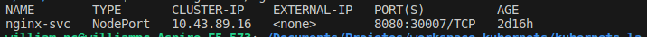

## Conceitos

Necessidade
 - Variáveis de ambiente
 - Gerenciamento de senhas/secrets
 - Escolher os recursos computacionais que a minha aplicação roda
 - Healh Check
 - Load Balancing
 - SSL/TLS
 - Domínio (www) - Determinado serviço - Ingress
 - Estratégia de deploy (Blue/Green, Canary, etc)
 - Storage
 - Service Discovery / DNS

## kubectl

Os arquivos de manifestos dos exemplos para subir com  `kubectl` estão na pasta `\manifestos`.

### Pods

a. Subindo um pod pelo manifesto
```shell
kubectl apply -f pod.yaml
```
b. View Pods
```shell
kubectl get pods
```


c. Deletar um pod
```shell
kubectl delete pod nginx
```

Obs:
> O problema de subir apenas pods é que não tem outro pod rodando significando que a aplicação ficará fora do ar. 

### ReplicaSet


`ReplicaSet` ou `RS` é uma camada acima de pods que tem a função de verificação de pods garandindo que estejam sempre rodando. Através do `RS` que se configura o número de pods que devem estar rodando de uma aplicação e quantas réplicas do mesmo devem estar rodando. E para que o ReplicaSet possa enchergar os pods é necessário criar  `label` nos pods, pois é através disso que o `RS` gerencia os pods. 


#### Subindo um ReplicaSet pelo manifesto

```shell
kubectl apply -f replicaset.yaml
```
#### Visualizar os ReplicaSet

```shell
kubectl get rs
```


 Se visualizar os pods com `kubectl get pods` obterá um nome algo parecido com `nginx-replicaset-<hash>` mostrando que o pod está sendo gerenciado pelo replicaset `nginx-replicaset` e o pod possui um hash que o identifica no RS. Logo se o pod for derrubado o RS garante que pelo menos 1 instancia seja garantida. 

 #### Alterando replicas no manifesto
   
   Altere o manifesto com mais replicas adicinando
   ```properties
    spec:
        replicas: 10
   ```
   e rode novamente `kubectl apply -f replicas.yml` para subir as 10 replicas atualiza.

   

   #### Testando POD com port-forward
   Pode testar algum container diretamente abrindo porta de acesso direto com o comando 
   ```shell
   kubectl port-forward pod/nginx-replicaset-bt8dh 8080:80
   ```
   A porta 8080 do pc local está mapeado para a porta 8080 do container. Acesse http://localhost:8080/

   

   A questão do `ReplicaSet` é que ele é apenas um garantidor de replicas e quando o manifesto tem uma imagem alterada é necessário deletar os pods um por um para que o replicaset possa subir novos pods atualizados. Porém existe outra forma de atualizar todos os pods num replicaset, utilizado `deployment`

## Deployment

O `Deployment` é um layer acima do `ReplicaSet` 


`Deployment` gerencia replicaset de acordo com sua especificação. Ele quem é responsável por criar `replicaset` e este por sua vez cria os `pods`. No entanto se um `Deployment` tiver alguma alteração em sua especificação será criado automaticamente outro `replicaset` com novos `pods` atualizados ao mesmo tempo em que é desligado os pods do replicaset anterior.


#### Subindo um Deployment pelo manifesto

```shell
kubectl apply -f deployment.yaml
```
#### Visualizar o Deployment

```shell
kubectl get deployment
```


#### Visualizar o RS gerado pelo Deployment
```shell
kubectl get rs
```


#### Visualizar os pods gerado pelo RS
```shell
kubectl get pods
```


Obs:
> Os nomes dos pods criados seguem uma nomenclatura como `<deployment>-<replicaset>-<pod>` identifando qual é o deployment e o rs ao qual o pod pertence.

#### Alterando manifesto
Se o `Deployment` tiver alguma alteração em sua especificação como por exemplo, mudança de versão de imagem, quando for novamente execultado irá criar outro `replicaSet` que por sua vez criará outros pods ao mesmo tempo que vai desligando os pods do `replicaset` antigo conforme abaixo.

Novo ReplicaSet


Novos pods:


Sendo assim, se o `deployment` precisar ser feito rollback irá subir junto o `replicaset` anterior.

## Service

Nos exemplos acima temos 10 replicas de pods e para que seja feito um balanceamento de cargas entre os pods precisa configurar um `Service` para que o Kubernets faça o balanceamento.


Para que o `service` possa enxergar os pods para o balanceamento é necessário configurar `labels` nos pods e apontar o service para eles.

#### Subindo um Service pelo manifesto

```shell
kubectl apply -f service.yaml
```
#### Visualizar o Service

```shell
kubectl get svc
```



O service `nginx-service` por padrão é do tipo `ClusterIP`, ou seja, tem um IP interno (ex: 10.43.253.151) e quem chamar esse serviço por esse endereço será redirecionado a algum pod pela porta 80 através do balanceamento de carga. O padrão de balanceamento no exemplo é `round robin`.

 #### Testando service com port-forward local
   Pode testar algum container diretamente abrindo porta de acesso direto com o comando 
   ```shell
   kubectl port-forward svc/nginx-service 8080:80
   ```
   A porta 8080 do pc local está mapeado para a porta 80 do service. Acesse http://localhost:8080/


Obs:
> O `service` foi criado com nome `nginx-service`, ou seja, sua chamada pode ser feita também através desse nome pois o kubernets já faz resolução automática de nome vinculando a um IP que pode mudar com tempo. Sendo assim o Kubernet tem `Sevice Disconvery` e `DNS`.


#### Expondo porta para teste externo
O tipo padrão de service é `ClusterIp` e para testar a aplicação e permitir que seja acessado pela internet é preciso configurar o manifesto  `service` para que ele gere um IP Externo de acesso pela núvem. No caso é necessário configurar o manifesto para o tipo `LoadBancer`:

 Altere o manifesto 
   ```properties
    spec:
        type: LoadBalancer
   ```

   Isso irá fazer com que o service `nginx-service` seja do tipo `LoadBalancer` ao mesmo tempo em que será gerado EXTERNAL-IP que pode ser acessado externamente. No exemplo abaixo está `<pending>` pois nosso exemplo não é um provedor de IP como AWS, Azure, Digital Ocean dentre outros. Logo esse IP gerado funcina perfeitamente nos services da núvem.


### Comandos diversos

Escalando pods no deployment
```shell
kubectl scale deployment nginx-deployment --replicas=1
```

Visualizaar logs de pods
```shell
kubectl logs nginx-deployment-69b96679f-ppnsf
```

## Referencias

[Iniciando com Kubernets - Youtube - FullStack](https://www.youtube.com/watch?v=tRbFs3CCyPQ)

[Tutorial Kubernetes](https://kubernetes.io/docs/tutorials/)

[Tutorialspoint Kubernetes](https://www.tutorialspoint.com/kubernetes/index.htm)

[K3D](https://k3d.io/v5.6.0/)

[Como instalar K3D](https://blog.4linux.com.br/k3d-utilizando-uma-solucao-para-realizar-labotarorios-de-kubernetes-de-baixo-custo-computacional/)

